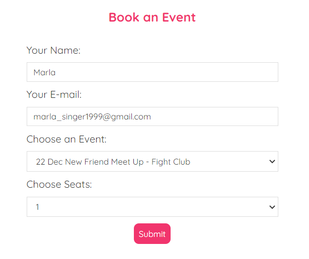

# Web Server for Booking System

Front-end section using `react.js`

Back-end section using the `restbed` framework in `C++` to implement web RESTful API, and then using multithreading data handler with mutex to avoid data races

Data is stored and accessed using `MySQL`.


## User Interface

Users can input their names and contact E-mail address, and choose the event they wants to participate in and the number of booked paticipants.
After filling the tables, users can click the button and submit this booking.



## Server Interface

Once the submission from users, the information will transfer to the server side. The booking detials will be stored in relevant database with MySQL.

```SQL
mysql> SELECT member_tb.name, member_tb.email, member_tb.seat, event_tb.m_name, event_tb.m_showdate 
    -> FROM member_tb LEFT JOIN (event_tb) ON (member_tb.event = event_tb.m_id);
+-------+----------------------------+------+-----------------+------------+
| name  | email                      | seat | m_name          | m_showdate |
+-------+----------------------------+------+-----------------+------------+
| Rumi  | rumi@gmail.com             |    2 | The Dark Knight | 2022-12-21 |
| Kader | kader@bristol.ac.uk        |    4 | Titanic         | 2022-12-23 |
| Marla | marla_singer1999@gmail.com |    1 | Fight Club      | 2022-12-22 |
+-------+----------------------------+------+-----------------+------------+
3 rows in set (0.00 sec)

```

### Execution Details
```LINUX
og21xxx@DESKTOP-XXXXXX9B:~/Web_Server_for_Booking_System$ sys_backend/build/BookingAPI
Database Connected
Wait to continue...
Database Connected To MySql0x7fffe825b3b0
Wait to continue...
Web Server Connected Successfully ...

Recieved data : Marla marla_singer1999@gmail.com 2 1

Successfully added in database.

```
